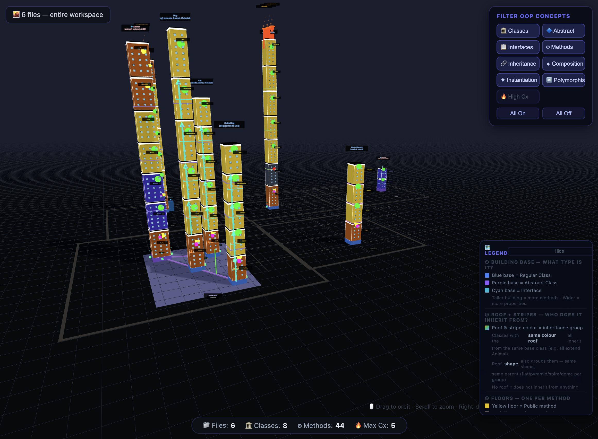

# Code City 3D Visualizer

> Visualize your codebase as an interactive 3D city — classes become buildings, inheritance shapes the skyline.

---

## Features

- **3D City Metaphor** — Each class is rendered as a building. Building height reflects the number of methods; width reflects the number of fields.
- **Inheritance Districts** — Classes that share a parent are grouped into districts with matching colors and roof styles, making family relationships immediately visible.
- **Complexity at a Glance** — Color intensity and building height encode complexity, so hotspots stand out without reading a single line.
- **Live Refresh** — The city updates automatically every time you save a file.
- **Orbit, Zoom, Pan** — Full 3D navigation with mouse controls.

---

## Supported Languages

| Language | File Extension |
|----------|---------------|
| Python   | `.py`         |
| PHP      | `.php`        |
| C#       | `.cs`         |

---

## Installation

### From the Marketplace
Search for **"Code City 3D Visualizer"** in the VS Code Extensions panel and click **Install**.

### From a `.vsix` file
1. Download the latest `.vsix` from the [Releases](https://github.com/thenurihettiarachchi/code-city-visualizer/releases) page.
2. Open the Extensions panel (`Ctrl+Shift+X`).
3. Click the `···` menu → **Install from VSIX…**
4. Select the downloaded file.

---

## How to Use

1. Open any `.py`, `.php`, or `.cs` file in VS Code.
2. Press `Ctrl+Shift+V` (Mac: `Cmd+Shift+V`) — or click the city icon in the editor title bar.
3. The 3D city loads in a side panel. Navigate with your mouse.
4. Save your file at any time to refresh the visualization.

### Keyboard Shortcut

| Shortcut | Action |
|----------|--------|
| `Ctrl+Shift+V` / `Cmd+Shift+V` | Open 3D Code City |

### Command Palette

Open the Command Palette (`Ctrl+Shift+P`) and search:

| Command | Description |
|---------|-------------|
| `Code City: Open 3D Code City` | Open the visualization panel |
| `Code City: Refresh 3D Code City` | Manually refresh the city |

---

## 3D Navigation Controls

| Input | Action |
|-------|--------|
| Left drag | Orbit / rotate the city |
| Scroll wheel | Zoom in and out |
| Right drag | Pan across the city |

---

## Requirements

- VS Code `1.80.0` or later
- No additional dependencies — everything is bundled.

---

## Known Issues

- Very large files with hundreds of classes may cause the initial render to take a few seconds.
- Flowchart view is used as a fallback for files with no detectable class structure.

---

## Release Notes

### 1.0.2
- Stability improvements and parser fixes.

### 1.0.1
- Added symbol input support.

### 1.0.0
- Initial release with Python, PHP, and C# support.

---

## License

[MIT](LICENSE)
